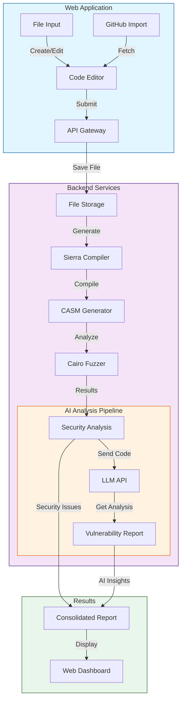

# Encode London 2024 Project

ToDo

# Abstract

## Deployment

**Base Sepolia**

- `MockERC20` - ``
- `MockVault` - ``
- `VulnerableVault` - ``

# Features

## For Developers - Security Scanner

## For Users - Insurance

ToDo

# Bounties

# Setup

## Project Setup

### Backend

- git clone and build cairo locally

- git clone and build cairo-fuzzer

- fill out env variables with `COMPILE_DIR` as relative path based on backend directory and `FUZZING_DIR` as relative path based on compile directory

- install dependencies with `npm i`

### Frontend

- fill out `.env` based on the `.env.example` //todo

- execute `npm i` to install local dependencies

- execute `npm run dev` to start frontend web app

- execute `npm run api` to start backend //todo

### Smart Contracts

- install all tools required for Starket and Cairo to work - those can be found in Cairo book

- install all required tools to work with EVM networks - Foundry, VS code extensions etc

- execute `forge install OpenZeppelin/openzeppelin-contracts --no-commit` inside `contracts/foundry_evm` directory

- run evm tests using `forge test -vv`

- deploy evm contract to Base Sepolia or your chosen network
