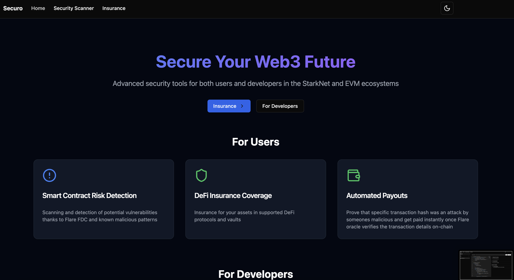
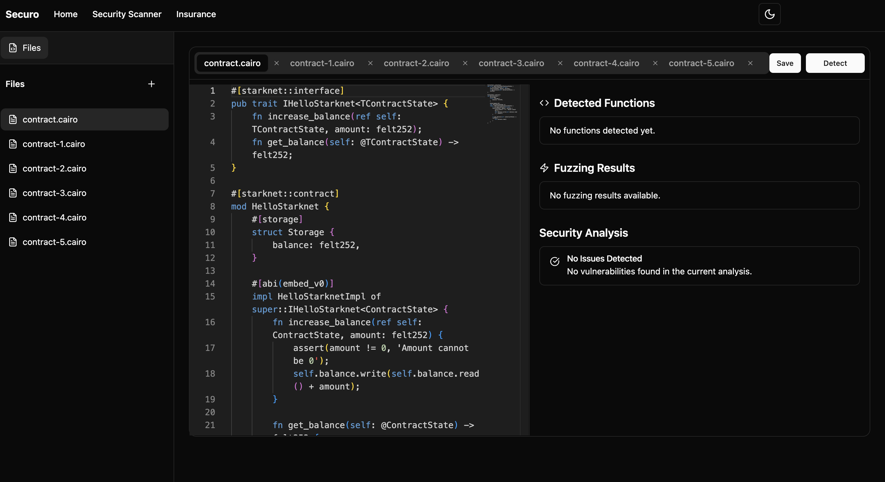
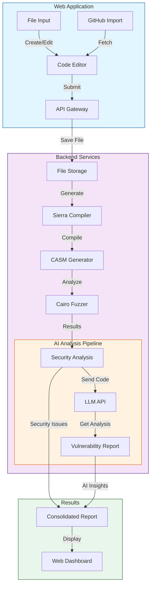
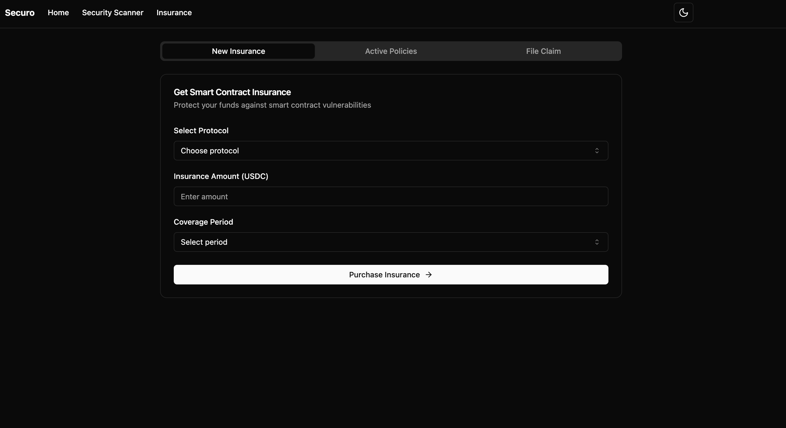
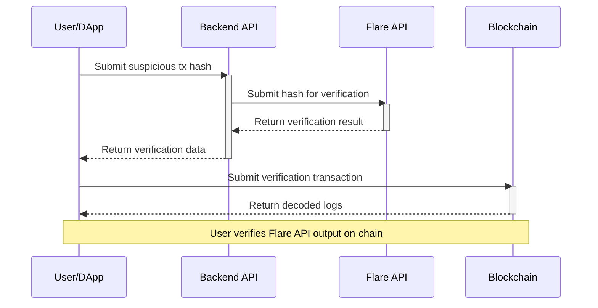

# Securo - Encode London 2024 Project

# Abstract

Securo - Security Aggregator provides most needed functionalities for coders developing their smart contracts in Cairo for Starknet and for users interacting with defi protocols on EVM networks like Base.

## Deployment

**Base Sepolia**

- `MockERC20` - `0x5aAdFB43eF8dAF45DD80F4676345b7676f1D70e3`
- `MockVault` - `0xf13D09eD3cbdD1C930d4de74808de1f33B6b3D4f`
- `VulnerableVault` - `0x5c4a3C2CD1ffE6aAfDF62b64bb3E620C696c832E`

# Features

## For Developers - Security Scanner

## For Users - Insurance

# Bounties

- Compass Labs

- Base

- Flare

- Nethermind

- ICP

- Blocksense

# Setup

### Backend

- git clone and build cairo locally

- git clone and build cairo-fuzzer

- fill out env variables with `COMPILE_DIR` as relative path based on backend directory and `FUZZING_DIR` as relative path based on compile directory

- install dependencies with `npm i`

- run files with `node <file_name.js>`

### Frontend

- fill out `.env` based on the `.env.example` //todo

- execute `npm i` to install local dependencies

- execute `npm run dev` to start frontend web app

- execute `npm run api` to start backend //todo

### Smart Contracts

- install all tools required for Starket and Cairo to work - those can be found in Cairo book

- install all required tools to work with EVM networks - Foundry, VS code extensions etc

- execute `export PRIVATE_KEY=<YOUR_PRIVATE_KEY>`

- execute `forge install OpenZeppelin/openzeppelin-contracts --no-commit` inside `contracts/foundry_evm` directory

- run evm tests using `forge test -vv`

- deploy Solidity contractc to Base Sepolia or your chosen EVM network
